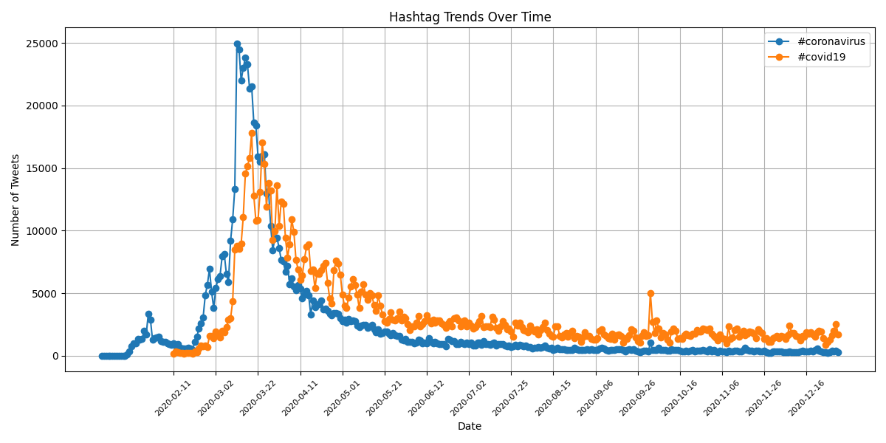

# Coronavirus Twitter Analysis

## Project Description

This project analyzes geotagged tweets from 2020 to track trends in hashtags related to COVID-19. Using the MapReduce framework, the project processes large-scale Twitter datasets to extract relevant hashtags, aggregate their occurrences by language and country, and visualize the results. The analysis provides insights into how discussions around COVID-19 evolved across different regions and languages.

**Learning Objectives:**
1) Work with large-scale datasets
2) Work with multilingual text
3) Use the MapReduce divide-and-conquer paradigm to create parallel code

## Data

The dataset consists of geotagged Twitter data files from 2020, formatted as `geoTwitterYY-MM-DD.zip` for each day of the year. Inside each zip file is 24 text files for each hour of the day. These files contain counts of hashtags used in different countries and languages, extracted during the map and reduce phases. The processed data is stored as JSON files, which serve as inputs for visualization.

## Steps Taken

1) Map Phase (data preprocessing): `map.py`
   * Extract hashtags (coronavirus-related) and count occurrences by country and language.
   * Store intermediate results as JSON files.    
2) Reduce Phase (aggregation): `reduce.py`
   * Combine and sum hashtag counts across multiple data files.
   * Output final JSON files containing total counts for each hashtag by country and language.
3) Visualization
   * `visualize.py`: Generate bar plots for the most frequent hashtags by country and language.
   * `alternative_reduce.py`: Create a time-series analysis plot of hashtag trends over the course of the year.

## Results

**Top 10 Languages Using #coronavirus**


**Top 10 Languages Using #코로나바이러스 (Korean coronavirus hashtag)**


**Top 10 Countries Using #coronavirus**


**Top 10 Countries Using #코로나바이러스**


**Time-Series Trend of #coronavirus and #covid19**


## How to Run the Analysis

1) Run the Mapper
```
./run_maps.sh
```

2) Run the Reducer for both Country and Language
```
python3 src/reduce.py --input_paths outputs/*.json --output_path outputs/country.json
python3 src/reduce.py --input_paths outputs/*.json --output_path outputs/lang.json
```

3) Generate the Bar Plots from `visualize.py`
   * For Language Data
     ```
     python3 src/visualize.py --input_path outputs/lang.json --key='#coronavirus'
     python3 src/visualize.py --input_path outputs/lang.json --key='#코로나바이러스'
     ```
   * For Country Data
     ```
     python3 src/visualize.py --input_path outputs/country.json --key='#coronavirus'
     python3 src/visualize.py --input_path outputs/country.json --key='#코로나바이러스'
     ```

4) Generate the Time-Series Analysis Plot from `alternative_reduce.py`
```
python3 src/alternative_reduce.py --hashtags '#coronavirus' '#covid19' --input_folder outputs/ --output_path graphs/trend_plot.png
```
